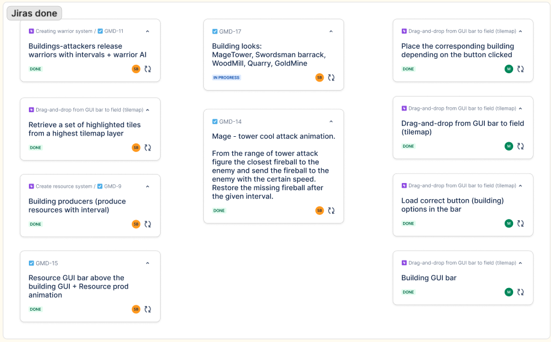

Welcome back, dear reader of this fabulous blog!
We are here with the updates - days and sleepovers of working must have yielded at least something...
Yet we don't have the Proof of Concept even. Have to keep up the pace to make it for the next 4th deliverable.

What we have instead is the skeleton of a working gamem but that hides away hidden layers of work.
Those were figuring and setting up file-sharing (git and plastic. Sevastian must have told you in person).
We combine both for the reasons that we are comfortable with Git, didn't like the hostility of the Unity VCS for the newcomers, but didn't want to work with github large file storage.
Setting it up was such a struggle, but what we have now is such an easy-to-wrok with system!
All the assets (images, tilemaps etc) are in Unity VCS a.k.a Plastic. The rest goes to git.
Such an intricate system is controlled by autogenerated ignore configs and utilzing git hooks, so if you desire to add something to the config, you have special files for that.

Second of all, the visuals: finding the style as well as having something temperary to start working with (although nothing is more permanent than temporary)
I think we are switching the tiles visuals, but no more than that. Seva has invested lots of time into the other visuals - mage tower and warriors. Basically, he had long talks and disputes with ChatGPT Sora.  
Considering the pace and the time limits, we think it is okay to take such a shortcut, although we consider the dangers of using AI - this thing sucks your creativity out and makes you useless the more you use it.  
But we shall not be conserned. We know for sure we would draw mindblowing visuals ourselfs if had infinite time.

Third of all, organization. Setting up simplified Jira and writing down the scope. I think it is a fun way of using Jira - inserting it as interactive Figma elements. Just makes it better, I hope you get the jist.

Otherwise, we see what our steps are to the goal, and we are marching!
Short summary of things done about coding in Unity itself:

- Made an UI for selecting the buildings to building
- Made a resource system - some object just add gold or whatever to the bank
- Made mage tower with animations
- Made Swordsman AI
  You can see all the tasks completed in the image attached!

Overall, we are meticulously trying to make things as scalable as possible. We aren't up with half-measure. If we were implementing the highlight, we implement it right.
Cause what if we might wanna have a 2 x 2 building later? or 3 x 1? We have to dynamically highlight the area depending on the size of the building.  
And so on :)

We are excited of what seeks us next!

